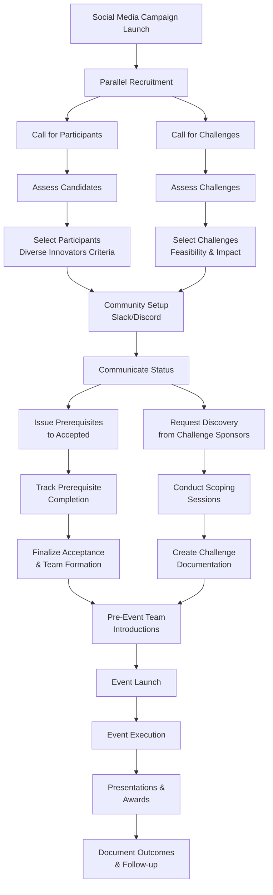

# Process Workflow

## Visual Process Overview

## Detailed Process Steps

### Phase 1: Campaign Launch & Recruitment (Parallel)

**1.0** Launch ongoing social media campaign

- Create awareness across target audiences
- Build anticipation for upcoming event
- Share success stories from previous events

**1.1** Call for participants

- Digital flyer with clear value proposition
- Website with prerequisites and FAQ
- Application form with screening questions

**1.2** Call for challenges

- Digital flyer targeting challenge sponsors
- Website with examples and submission guidelines
- Submission form for challenge details

### Phase 2: Assessment

**2.1** Assess participant candidates against criteria

- Technical background and potential
- Motivation and commitment level
- Diversity and team fit considerations
- Prerequisite completion capability

**2.2** Assess challenges for feasibility and learning value

- Scope appropriate for event timeframe
- Data availability and access
- Learning opportunities for participants
- Real-world impact potential

### Phase 3: Selection & Community Setup

**3.1** Select participants using diverse innovators criteria

- Technical skill diversity
- Academic/professional background mix
- Demographic diversity
- Geographic representation (if applicable)

**3.2** Select challenges based on scope and impact potential

- Clear problem definition
- Available data and resources
- Sponsor engagement level
- Technical feasibility

**3.3** Set up community channels (Slack/Discord) for:

- **Onboarding and office hours** - Welcome new participants
- **Pre-event interactions and Q&A** - Build community before event
- **Event management** - Team channels, mentor channels during event
- **Tutorial/walkthrough content delivery** - Share learning resources
- **Post-event community building** - Maintain connections after event

### Phase 4: Communication & Prerequisites

**4.1** Communicate status to all applicants

- **4.1.1** Begin prerequisite tracking for accepted participants
- **4.1.2** Issue FAQ for accepted participants

**4.2** Communicate status to challenge sponsors

- Inform on selection status (selected/waitlist/not selected)
- Request discovery/scoping for selected challenges
- Provide timeline and expectations

### Phase 5: Vetting & Scoping

**5.1** Continue vetting accepted vs. waitlist participants

- Monitor prerequisite completion progress
- Assess continued engagement and motivation
- Make final selections based on completion rates

**5.2** Hold scoping sessions with challenge sponsors

- Conduct detailed interviews about the challenge
- Clarify success criteria and constraints
- **5.2.1** Optionally provide question scripts for self-recorded discovery

### Phase 6: Finalization & Preparation

**6.1** Finalize acceptance list and validate prerequisite completion

- **Prerequisites include:**
  - Generative AI 101
  - Prompt Engineering 101
  - Bedrock 101
  - IDE/Virtual Environment setup
  - Vibe Coding 101
- **6.1.1** Issue waivers, technical skills survey, problem theme preferences

**6.2** Create challenge documentation

- **6.2.1** Summarize discovery interviews into clear problem statements
- **6.2.2** Acquire and stage data in cloud environment with discovery documentation
- **6.2.3** Follow up with challenge sponsors as needed for clarification

### Phase 7: Team Formation & Challenge Introduction

**7.1** Organize balanced teams

- Mix technical and non-technical participants
- Consider complementary skills and backgrounds
- Introduce team members to each other via community platform

**7.2** Introduce challenges to participants/teams

- Present problem statements and available resources
- Allow teams to express preferences
- Facilitate matching process

### Phase 8: Event Launch

**8.1** Launch event with structured agenda

- Welcome and orientation
- Set expectations and success criteria
- Begin structured learning and project work

### Phase 9: Event Execution Framework

**9.1** General event architecture includes:

**9.1.1** Introduction/culture kickoff

- Welcome participants and set tone
- Introduce mentors and facilitators
- Establish collaboration principles

**9.1.2** 1:many lectures and hands-on labs

- Core AI concepts and technologies
- Practical skills development
- Interactive learning sessions

**9.1.3** Team/project time allocation

- Dedicated work sessions with mentor support
- Regular check-ins and progress reviews
- Problem-solving and troubleshooting

**9.1.4** Team building activities

- Non-technical bonding experiences
- Communication and collaboration exercises
- Fun activities to build relationships

**9.1.5** Choose-your-own-adventure breakouts (Innovation Stations)

- Specialized skill tracks
- Advanced topic deep-dives
- Flexible learning paths

**9.1.6** Applied mentorship to teams

- Expert guidance on technical challenges
- Project management support
- Professional development advice

**9.1.7** Guest speaking sessions

- Inspirational talks from industry leaders
- Industry perspectives on AI trends
- Future of AI and workforce needs
- Presentation skills development

**9.1.8** Team presentations and demonstrations

- Structured presentation format
- Peer and expert feedback
- Solution demonstrations

**9.1.9** Awards ceremony and closing

- Recognition of achievements
- Celebration of learning outcomes
- Next steps and continued engagement

**9.1.10** Document outcomes and follow-up

- Summarize team outputs and solutions
- Document lessons learned
- Follow up with challenge sponsors on results
- Plan community maintenance and next events

## Success Metrics

### Participant Metrics

- Skill development assessment (pre/post)
- Project completion rate
- Team collaboration effectiveness
- Satisfaction scores

### Challenge Sponsor Metrics

- Problem scoping quality
- Prototype value assessment
- Follow-up engagement level
- Return participation rate

### Event Metrics

- Application-to-acceptance ratio
- Prerequisite completion rate
- Event attendance and engagement
- Community platform activity post-event
